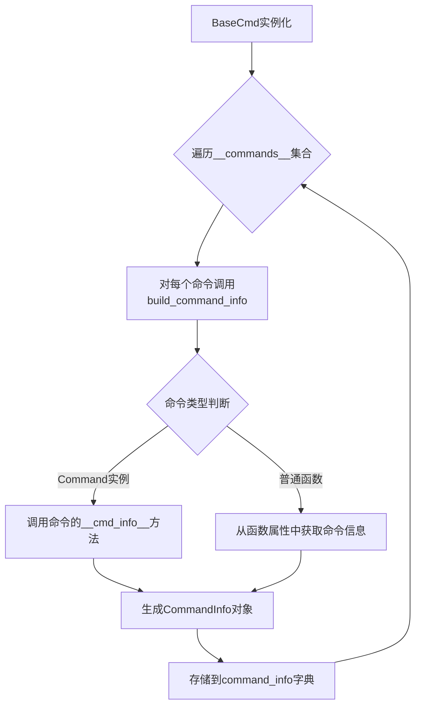
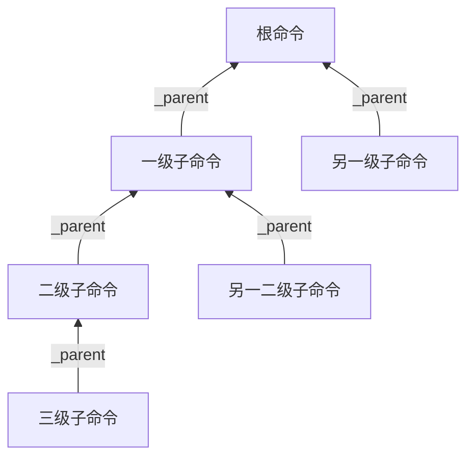
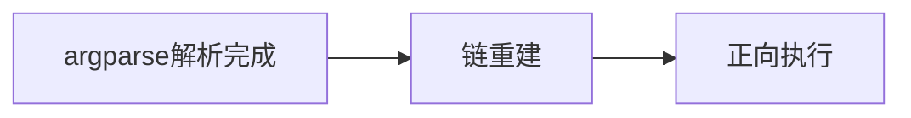

# 命令系统

为了在兼容类似`cmd`的以手动解析为主的命令系统的同时，提供上层的命令参数自动解析功能，`ptcmd`使用了多级分层的命令系统。

## 命令元信息

命令元信息是直接由`BaseCmd`与`Cmd`类使用的命令信息：

```python linenums="1"
class CommandInfo(NamedTuple):
    name: str
    cmd_func: Callable[[List[str]], Any]
    help_func: Optional[HelpGetterFunc] = None
    category: Optional[str] = None
    completer: Optional[Completer] = None
    argparser: Optional[ArgumentParser] = None
    hidden: bool = False
    disabled: bool = False

    def __cmd_info__(self, cmd_ins: "BaseCmd", /) -> "CommandInfo":
        return self
```

### 命令信息收集

由于命令名称、处理函数等均依赖`Cmd`实例本身的属性配置或直接需要与实例绑定，因此命令信息收集发生在`Cmd`实例初始化阶段最后。

命令信息收集的逻辑如下：



- 如果存在`__cmd_info__`方法，则调用该方法获取命令信息
- 否则，从函数属性中获取命令信息

### 设置命令信息

可以通过`ptcmd.info`模块提供的`set_info`装饰器来手动设置命令信息：

```python linenums="1"
from argparse import ArgumentParser
from ptcmd import Cmd, set_info

class App(Cmd):
    _hello_parser = ArgumentParser("hello")
    _hello_parser.add_argument("name", nargs="?", default="World", help="Name to greet")

    @set_info(name="hi", help_category="Greeting")
    @set_info(argparser=_hello_parser)
    def do_hello(self, argv: list[str]) -> None:
        ...
```

也可以通过创建一个实现了`__cmd_info__`方法的实例来自定义返回的命令信息。相关Protocol定义如下：

```python linenums="1"
class CommandInfoGetter(Protocol):
    def __cmd_info__(self, cmd_ins: "BaseCmd", /) -> CommandInfo:
        """Get the command information for this command.

        :param cmd_ins: The instance of the `cmd` class
        :type cmd_ins: "BaseCmd"
        :return: The command information
        """
        ...
```

## 通用的上层命令封装——Command

手动设置命令信息虽然提供了更强的可控性，但通常来说，我们更希望有一个更加简便的方式来定义一般的命令。

`Command`是一个通用的命令封装类，实现了`__cmd_info__`方法，允许以自动或手动的方式设置命令信息。与直接使用`set_info`相比，`Command`类提供了如下的功能：

### 声明式参数解析

`ptcmd`通过`@auto_argument`装饰器和`Arg`类型提示提供了声明式参数解析功能，消除了样板参数解析代码。该系统自动根据函数签名生成`ArgumentParser`实例，使命令定义既简洁又类型安全。

#### 基础用法

使用`@auto_argument`装饰器是最简单的声明式参数解析方式。它会自动分析函数的参数签名，并创建相应的`ArgumentParser`实例：

```python linenums="1"
from ptcmd import Cmd, auto_argument

class MyApp(Cmd):
    @auto_argument
    def do_hello(self, name: str = "World") -> None:
        """Hello World!"""
        self.poutput(f"Hello, {name}!")
```

在上面的例子中，`name`参数会自动转换为一个可选的位置参数，默认值为"World"。

#### Arg类型提示详解

对于更复杂的参数定义，可以使用`Arg`类型提示。`Arg`允许指定参数的标志、帮助文本和其他属性：

```python linenums="1"
from ptcmd import Cmd, Arg, auto_argument

class MathApp(Cmd):
    @auto_argument
    def do_add(
        self, 
        x: float, 
        y: float,
        *,
        verbose: Arg[bool, "-v", "--verbose", {"help": "详细输出"}] = False
    ) -> None:
        """两数相加"""
        result = x + y
        if verbose:
            self.poutput(f"{x} + {y} = {result}")
        else:
            self.poutput(result)
```

`Arg`的语法格式为：`Arg[类型, 参数标志..., {参数属性}]`

- 类型：参数的数据类型（如`str`、`int`、`float`、`bool`等）
- 参数标志：参数的命令行标志（如`"-v"`、`"--verbose"`）
- 参数属性：一个字典，包含参数的其他属性（如`help`、`choices`等）

#### 参数类型和行为

`ptcmd`会根据参数的类型和位置自动推断参数的行为：

1. 位置参数：函数的位置参数会转换为命令行的位置参数
2. 可选参数：使用`*`分隔的关键字参数会转换为可选参数
3. 布尔参数：类型为`bool`的参数会自动转换为标志参数（`store_true`或`store_false`）
4. 默认值：参数的默认值会传递给`ArgumentParser`

```python linenums="1"
@auto_argument
def do_example(
    self,
    positional: str,                    # 位置参数
    optional: int = 10,                 # 带默认值的位置参数
    *,
    flag: Arg[bool] = False,            # 布尔标志参数
    option: Arg[str, "--option"] = "default"  # 可选参数
) -> None:
    pass
```

#### Literal类型与自动choices

当使用`Literal`类型时，`ptcmd`会自动将字面值设置为参数的可选项：

```python linenums="1"
from typing import Literal
from ptcmd import Cmd, auto_argument

class App(Cmd):
    @auto_argument
    def do_set_level(
        self, 
        level: Literal["debug", "info", "warning", "error"]
    ) -> None:
        """设置日志级别"""
        self.poutput(f"日志级别设置为: {level}")
```

在上面的例子中，`level`参数会自动具有`choices=["debug", "info", "warning", "error"]`属性。

#### 与Annotated的兼容用法

如果类型检查器对`Arg`语法报错，可以使用标准的`Annotated`和`Argument`：

```python linenums="1"
from typing import Annotated
from ptcmd import Cmd, Argument, auto_argument

class MathApp(Cmd):
    @auto_argument
    def do_add(
        self, 
        x: float, 
        y: float,
        *,
        verbose: Annotated[bool, Argument("-v", "--verbose", action="store_true")] = False
    ) -> None:
        """两数相加"""
        result = x + y
        if verbose:
            self.poutput(f"{x} + {y} = {result}")
        else:
            self.poutput(result)
```

### 任意多级子命令

`ptcmd`支持为一个命令添加任意多级子命令，这使得构建复杂的命令层次结构变得简单。

#### 基础子命令用法

通过`add_subcommand`方法可以为命令添加子命令：

```python linenums="1"
from ptcmd import Cmd, auto_argument

class App(Cmd):
    @auto_argument
    def do_server(self):
        """服务器管理"""

    @do_server.add_subcommand("start")
    def server_start(self):
        """启动服务器"""
        self.poutput("服务器已启动")

    @do_server.add_subcommand("stop")
    def server_stop(self):
        """停止服务器"""
        self.poutput("服务器已停止")
```

在上面的例子中，`do_server`是主命令，`server_start`和`server_stop`是它的子命令。用户可以通过`server start`和`server stop`来调用这些子命令。

#### 多级嵌套子命令

`ptcmd`支持任意层级的子命令嵌套：

```python linenums="1"
from ptcmd import Cmd, auto_argument

class App(Cmd):
    @auto_argument
    def do_server(self):
        """服务器管理"""

    @do_server.add_subcommand("db")
    def db(self):
        """数据库管理"""

    @db.add_subcommand("migrate")
    def migrate(self, version: str):
        """执行数据库迁移"""
        self.poutput(f"正在迁移到版本 {version}...")

    @do_server.add_subcommand("cache")
    def cache(self):
        """缓存管理"""

    @cache.add_subcommand("clear")
    def clear(self, confirm: bool = False):
        """清除缓存"""
        if confirm:
            self.poutput("缓存已清除")
        else:
            self.poutput("请添加--confirm参数确认操作")
```

在这个例子中，我们创建了两级子命令结构：
- `server` (主命令)
  - `db` (子命令)
    - `migrate` (二级子命令)
  - `cache` (子命令)
    - `clear` (二级子命令)

用户可以通过以下命令调用这些功能：
- `server db migrate v1.0`
- `server cache clear --confirm`

#### 实现原理

系统通过`ArgumentParser`的`defaults`机制实现**命令上下文传递**：

- **叶节点绑定**：在构建子命令解析器时，将叶节点命令实例注入`defaults`字典
- **覆盖特性**：当子命令被触发时，会覆盖父命令的`defaults`设置，自然形成指向最深层命令的引用
- **解析结果关联**：最终命名空间的`__cmd_ins__`属性直接关联到叶节点命令实例

这种设计巧妙利用`argparse`的原生机制——子命令解析器会覆盖父命令的默认值，使系统能在标准解析流程结束后，直接获取到终端命令的执行上下文，无需额外查找。

系统采用**轻量级引用链**构建命令层级：



核心机制：
- **反向引用**：每个子命令实例仅保存对其直接父命令的引用
- **动态构建**：命令树在解析过程中自然形成，无需预定义结构
- **路径重建**：通过递归访问`_parent`属性可重建完整调用路径
- **低开销**：每个命令仅增加一个引用关系，避免中心化注册表

这种设计完全基于`argparse`的子命令机制，通过最小化扩展实现了任意深度的命令嵌套。

执行流程聚焦于**解析后处理**：



1. **链重建阶段**：
   - 从`__cmd_ins__`获取叶节点命令实例
   - 通过`_parent`引用向上遍历构建完整命令链
   - 验证链的完整性和节点状态

2. **正向执行阶段**：
   - 将命令链反转为根→叶顺序
   - 依次执行各层级命令，传递中间结果
   - 返回叶节点的最终执行结果

关键价值在于：**充分利用标准解析结果**，通过叶节点重建执行路径后正向执行。系统不干预`argparse`的解析过程，仅在解析完成后注入执行逻辑，既保持与标准库的兼容性，又实现了复杂的命令结构支持。


## 帮助信息
